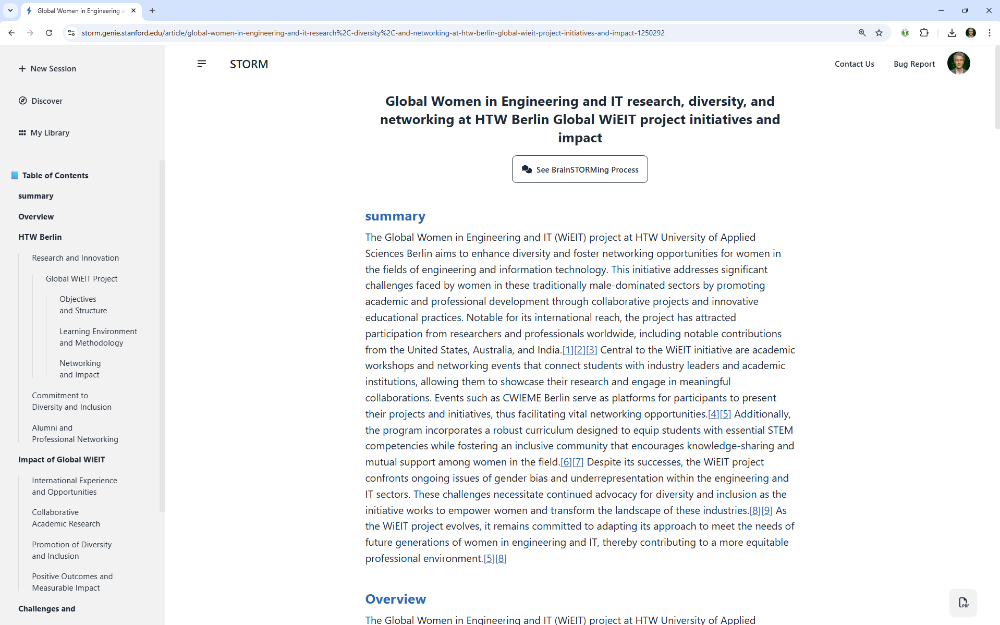
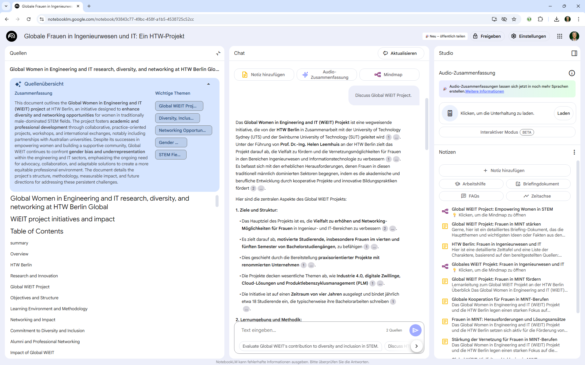

### ℹ️ Diese Anleitung ist auch Webversion verfügbar: [index.html](https://einsvier.github.io/AI-Models/)


# Workflow: KI-Tools für Recherche & Präsentation
# am Beispiel „Global Women in Engineering and IT“

## Ziel

In diesem Leitfaden erfährst du Schritt für Schritt, wie du mit frei verfügbaren KI-Tools eine Recherche durchführst, die Ergebnisse aufbereitest und multimedial präsentierst. Als Beispielthema dient „Global Women in Engineering and IT (Global WiEIT)“. Die Anleitung ist so gestaltet, dass du sie leicht auf eigene Themen übertragen kannst.

> **Praxisbeispiel aus der HTW Berlin:**
>
> Als Inspiration dient das Projekt ["Global WiEIT – Women in Engineering and IT"](https://www.htw-berlin.de/forschung/online-forschungskatalog/projekte/projekt/?eid=3159) der HTW Berlin. Es zeigt, wie internationale Zusammenarbeit und Diversität in MINT-Fächern gefördert werden können.

## 🗺️ Workflow auf einen Blick

1. **Prompt für Storm erstellen:** Formuliere eine präzise Fragestellung.
2. **Recherche bei Storm durchführen:** Nutze KI, um relevante Informationen zu sammeln.
3. **Zusammenfassung als PDF speichern:** Sichere die Ergebnisse übersichtlich.
4. **Weiterverarbeitung & Auswertung mit NotebookLM:** Strukturiere und analysiere die Inhalte weiter.
5. **Audio-Zusammenfassung mit NotebookLM erzeugen:** Lass dir die wichtigsten Erkenntnisse vorlesen.
6. *(Optional)* **Kurzes Video zur Zusammenfassung erstellen:** Präsentiere die Ergebnisse anschaulich.
7. **Alle Schritte dokumentieren & Anleitung veröffentlichen:** Teile deinen Workflow mit anderen.

---

## 🚦 Schritt-für-Schritt-Anleitung


### 1️⃣ Prompt für Storm erstellen

Formuliere einen klaren, prägnanten Prompt (max. 20 Wörter, keine Sonderzeichen wie Doppelpunkte). Je präziser dein Prompt, desto relevanter die Ergebnisse!

> **Beispiel:**
>

> `Global Women in Engineering and IT, focus on international projects, diversity, education, HTW Berlin`

💡 *Tipp: Je präziser der Prompt, desto relevanter die Ergebnisse!*

💡 **Tipp: ChatGPT als Prompt-Generator**

Du kannst ChatGPT nutzen, um schnell verschiedene Storm-Prompts zu deinem Recherchethema zu erstellen. Formuliere dein Thema in 1–2 Sätzen und bitte ChatGPT um mehrere Varianten mit jeweils maximal 20 Wörtern.

<details>
<summary>💡 <strong>Hinweis zum "Writing Purpose"</strong></summary>

Optional kann ChatGPT auch gleich einen freundlichen Satz zum <em>Writing Purpose</em> ergänzen, damit die Frage höflich und vollständig beantwortet wird.

</details>

**Beispiel-Frage an ChatGPT:**

> Formuliere für Storm drei Prompts (max. 20 Wörter) zu folgendem Thema: [DEIN THEMA]

Nutze dann den Vorschlag, der am besten passt, oder kombiniere mehrere.

**Beispiele für von ChatGPT erzeugte (optimierte) Prompts:**

> Women in IT, best practices worldwide, empowerment, role models, projects, education, challenges
>
> Global initiatives for women in tech, success stories, diversity, educational programs, international collaboration, HTW Berlin
>
> Advancing women in engineering and IT, global impact, diversity initiatives, educational access, leadership opportunities

---

### 2️⃣ Recherche mit Storm durchführen

1. Öffne [storm.genie.stanford.edu](https://storm.genie.stanford.edu)
2. Melde dich mit einem (kostenlosen) Account an.
3. Wähle als Session-Typ **“Storm Article”** aus (empfohlen für strukturierte Zusammenfassungen).
4. Wähle ein geeignetes Modell aus (z.B. GPT-4, Claude, Gemini).
5. Gib deinen Prompt ein und starte die Recherche.
6. Warte, bis die KI eine Zusammenfassung erstellt hat.




---


### 3️⃣ Zusammenfassung als PDF speichern

Nach Abschluss der Recherche kannst du die Zusammenfassung meist direkt als PDF herunterladen (Download-Button nutzen). *Alle verwendeten Quellen werden als Link am Ende der PDF aufgeführt – das sorgt für Transparenz, Nachvollziehbarkeit und erleichtert die Weiterverwendung.*

[](./STORM-Zusammenfassung-WiEIT-KI-Recherche.pdf) **[STORM-Zusammenfassung-WiEIT-KI-Recherche.pdf](./STORM-Zusammenfassung-WiEIT-KI-Recherche.pdf)**

> **Tipp:** Benenne die Datei sinnvoll, z.B. `STORM-Zusammenfassung-WiEIT-KI-Recherche.pdf`.

---


### 4️⃣ Weiterverarbeitung in NotebookLM

1. Gehe zu [NotebookLM](https://notebooklm.google.com/)
2. Melde dich mit deinem Google-Account an.
3. Erstelle ein neues Projekt
4. Lade das PDF hoch
5. Nutze die Funktionen von NotebookLM für Notizen, Gliederung und weiterführende Fragen



---


### 5️⃣ Audio-Zusammenfassung erstellen

1. Wähle in NotebookLM die Option „Audio-Zusammenfassung“.
2. Optional: Passe die Audio-Zusammenfassung mit einem Steer-Prompt an, z. B. für einen lockeren Ton oder einen bestimmten Dialekt.

> **Beispiel für einen Steer-Prompt:**
>
> *Fasse die wichtigsten Erkenntnisse locker und in der Du-Form zusammen. Eine Person spricht mit leichtem Berliner Dialekt.*


#### Beispiele für Audio-Zusammenfassungen

**Deutsche Fassung:**  
[Jetzt auf Google Drive anhören](https://drive.google.com/file/d/1CvezZ2r4u6MW_CeVnHUIhRGd3pdxrPS4/view?usp=sharing)

**Englische Fassung:**  
[Jetzt auf Google Drive anhören](https://drive.google.com/file/d/1wAAYlITrF6xm50641a3ofom8neQiIgst/preview)

---


### 6️⃣ (Optional) Video zur Zusammenfassung erstellen

Nutze Tools wie [Lumen5](https://lumen5.com/) oder [Pictory](https://pictory.ai/), um aus der Audio-Zusammenfassung ein kurzes Video zu machen.

> **Tipp:** Ein Video eignet sich besonders gut für Social Media oder Präsentationen.

---


### 7️⃣ Veröffentlichung & Dokumentation

1. Dokumentiere alle Schritte in diesem Repository
2. Füge Screenshots oder Beispiel-Dateien hinzu (Prompt, PDF, Audio, ggf. Video)
3. Teile die Anleitung mit anderen!

---


## 📁 Beispielhafte Projektstruktur

```text
/AI-Models
│
├── README.md                                 # Diese Anleitung
├── images/
│   ├── beispiel-notebooklm-screenshot.png    # Screenshot NotebookLM
│   └── beispiel-storm-screenshot.png         # Screenshot Storm
├── STORM-Zusammenfassung-WiEIT-KI-Recherche.pdf
├── audio/
│   ├── Globale_Frauen_in_Ingenieurwesen_und_IT_Ein_HTW-Projekt_german.wav   # Audio deutsch
│   └── Globale_Frauen_in_Ingenieurwesen_und_IT_Ein_HTW-Projekt_english.wav  # Audio englisch
└── Global WiEIT KI-Recherche – Ein Beispiel-Workflow.md                  # Workflow-Dokumentation
```

---


## ℹ️ Hinweise & Tipps

- Alle verwendeten Tools sind (Stand: Juni 2025) frei zugänglich.
- Entferne persönliche oder sensible Daten vor der Veröffentlichung.
- Bei Fragen oder Hinweisen: Eröffne einfach ein Issue im Repository!
- Es gibt noch viele weitere Tools und Wege, um Recherchen mit KI zu gestalten – diese Anleitung soll vor allem als Inspiration und Einstieg dienen.
- Weitere Infos und Modell-Übersicht: [Projekt-Wiki](https://github.com/EinsVier/AI-Models/wiki)
- Siehe auch: [KI-Tools Übersicht](https://github.com/EinsVier/KI-Tools/blob/main/README.md) 


**Viel Erfolg beim Nachmachen und Teilen!** 🚀

---
